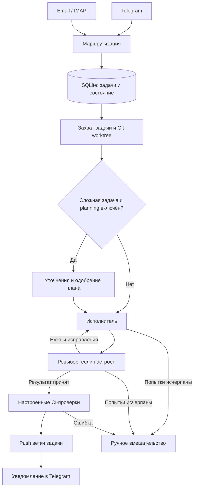

# AI Orchestration System

Python-supervisor для выполнения инженерных задач LLM-агентами: от сообщения в
Telegram или email до изменения в отдельной Git-ветке, проверки результата и
уведомления владельца.

Личный инженерный проект Никиты Крутикова. Основной интерес здесь - управление
жизненным циклом задачи: планирование, состояние, роли исполнителя и ревьюера,
продолжение после сбоев и решения человека. Оркестрация написана на Python/asyncio,
вызовы модели выполняются через Claude Code CLI.

## Какую задачу решает

При работе с несколькими AI-исполнителями приходится вручную передавать контекст,
собирать результаты, отправлять замечания на исправление и отслеживать зависшие
задачи. Supervisor объединяет эти действия в сохраняемый процесс с ограниченным
числом попыток и понятным выходом на ручное вмешательство.

Например, задача «добавить обработку ошибки в сервис» проходит через подготовку
рабочей копии, уточнение требований и планирование, работу исполнителя, отдельное
ревью, исправления и настроенные проверки. Итог сохраняется в ветке задачи.

## Как проходит задача



Планирование, ревьюер, модели, репозитории и команды проверок задаются в
[`config/agents.yaml`](config/agents.yaml). В основном pipeline роли работают
последовательно; dispatcher может вести несколько независимых задач одновременно.

## Что реализовано

| Часть системы | Поведение | Где смотреть |
| --- | --- | --- |
| Входящие задачи | Telegram polling, IMAP, дедупликация сообщений и привязка контакта к исполнителю | [`integrations/`](integrations), [`router.py`](supervisor/router.py) |
| Планирование | Уточняющие вопросы, классификация сложности, структурированный план, одобрение и пересмотр через Telegram | [`planner.py`](supervisor/planner.py), [`planning.py`](supervisor/stages/planning.py) |
| Состояние и владение задачей | SQLite, атомарный lease, продление срока захвата, проверка владельца между этапами | [`lease_manager.py`](supervisor/lease_manager.py), [`pipeline.py`](supervisor/pipeline.py) |
| Исполнение и ревью | Проверка структуры JSON, ограниченные повторы, возврат замечаний исполнителю, выбор модели и эскалация | [`execute.py`](supervisor/stages/execute.py), [`review.py`](supervisor/stages/review.py) |
| Контекст продолжения | Checkpoints с прогрессом и построение запроса для следующей сессии | [`session_manager.py`](supervisor/session_manager.py) |
| Работа с кодом | Кэш репозиториев, Git worktrees, ветки задач, проверки и доставка результата | [`repo_manager.py`](supervisor/repo_manager.py), [`deliver.py`](supervisor/stages/deliver.py) |
| Наблюдаемость | Журнал запусков, извлечение метрик токенов, стоимости и времени из CLI-ответов, ежедневная сводка | [`run_logger.py`](supervisor/run_logger.py), [`cost_tracker.py`](supervisor/cost_tracker.py), [`summarizer.py`](supervisor/summarizer.py) |
| Обслуживание | Снимок состояния, поиск зависших задач, ограниченные действия обслуживания и предложения с одобрением | [`health_monitor.py`](supervisor/health_monitor.py) |

## Инженерные решения

- **Логика процесса отделена от модели.** Python управляет этапами и состояниями;
  CLI-adapter запускает модель. `WorkerContext` передаёт контекст между этапами.
- **SQLite хранит прогресс.** WAL, миграции, leases, результаты запусков и checkpoints
  позволяют различать состояние задачи и состояние отдельного вызова модели.
- **Исполнитель и ревьюер имеют разные роли.** Замечания ревьюера возвращаются
  исполнителю; число итераций ограничено. Неустранённые ошибки требуют решения владельца.
- **Worktrees разделяют изменения задач.** Код проверяется и доставляется в ветке
  задачи. Для запуска полностью недоверенного кода потребуется отдельная OS-изоляция.
- **Права на команды ограничены.** CI и доставка используют профильный
  [`safe_exec`](supervisor/safe_exec.py); Bash-вызовы воркеров проходят через
  [`read-only hook`](supervisor/hooks/guard_bash.py). Для скрытия секретов в
  диагностике есть функция `redact()`.

## Проверить без доступа к модели и Telegram

Нужны Python 3.11+ и Git. Тесты используют временные БД, локальные тестовые
репозитории и подменяют внешние интеграции; авторизация Claude и реальные аккаунты
для них не требуются.

```bash
python -m pip install -r requirements.txt
python -m pytest tests/ -q
```

Для короткой проверки основных контрактов:

```bash
python -m pytest tests/test_lease_manager.py tests/test_pipeline.py tests/test_planning_stage.py tests/test_review_cycle.py tests/test_cost_and_session.py -q
```

В наборе есть проверки переходов состояний, конфликтов владения задачей, ошибок
ответов модели, планирования, ревью, продолжения сессии и доставки результата.
Для парсинга, нормализации и других инвариантов используются property-based tests
на Hypothesis. Локальные тесты проверяют поведение supervisor; качество решений
живой LLM требует отдельного набора evals.

Проверка 2026-10-01 на Windows: **501 passed, 5 skipped**. Платформенные пропуски
проверок Unix/Git отмечены в самих тестах; они не подтверждают Linux-развёртывание.

## Запуск с реальными интеграциями

Runtime ориентирован на Linux: рабочие копии подключаются к каталогам агентов
через символические ссылки. Нужны установленный и авторизованный Claude Code CLI,
Telegram-бот и настройки доступа к репозиториям; email подключается через IMAP.

```bash
python3 -m venv .venv
source .venv/bin/activate
python -m pip install -r requirements.txt
cp .env.example .env
```

1. В `.env` заполнить `TELEGRAM_BOT_TOKEN`, `TELEGRAM_OWNER_CHAT_ID` и переменные
   нужных интеграций. Учётные данные остаются вне Git.
2. В `config/agents.yaml` настроить контакты, активных исполнителей, роли ревьюеров,
   репозитории, ветки и команды проверок. Поставляемая конфигурация требует адаптации.
3. Проверить конфигурацию и запустить supervisor из корня репозитория:

```bash
python -c "from supervisor.config_validator import load_and_validate; load_and_validate(); print('Config OK')"
claude --version
python -m supervisor.main
```

Supervisor сам создаёт БД и применяет миграции. Команды владельца в Telegram
позволяют посмотреть задачи, одобрить или отклонить план, ответить на уточнение и
повторить неудачную задачу. Шаблон systemd-сервиса находится в
[`deploy/supervisor.service`](deploy/supervisor.service).

## Текущие границы проекта

- Это личная система оркестрации. Репозиторий показывает реализацию и локальную
  проверку; подтверждённое enterprise-внедрение или текущий VPS-запуск здесь не заявлены.
- [`team_runtime.py`](supervisor/team_runtime.py) содержит отдельно тестируемый
  компонент параллельных подзадач. Он пока не подключён к основному pipeline;
  отдельные worktrees для каждой такой подзадачи также требуют интеграции.
- GraphRAG и векторный поиск остаются дальнейшей работой. Сейчас память процесса
  представлена состоянием задач, результатами запусков и checkpoints в SQLite.
- CLI-adapter привязан к Claude Code. Модульная логика supervisor позволяет менять
  adapter, но второй backend в этой версии не реализован.
- Linux-развёртывание и поведение Windows-символических ссылок требуют отдельной
  проверки на целевой машине. Шаблоны deployment уже включены в репозиторий.

## Стек

Python 3.11+ · asyncio · SQLite/WAL · PyYAML · python-telegram-bot · IMAP ·
Claude Code CLI · Git worktrees · pytest · Hypothesis · systemd.
